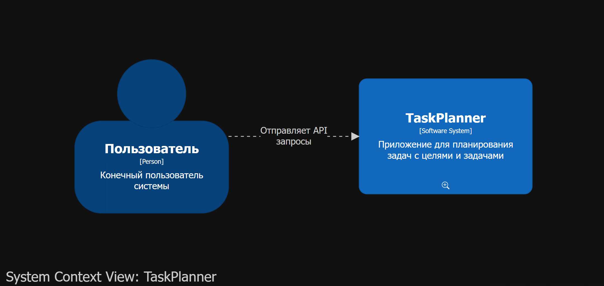
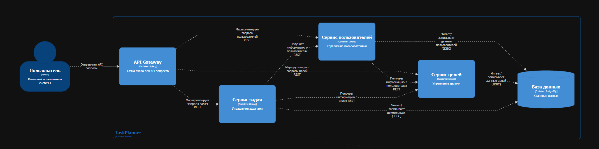
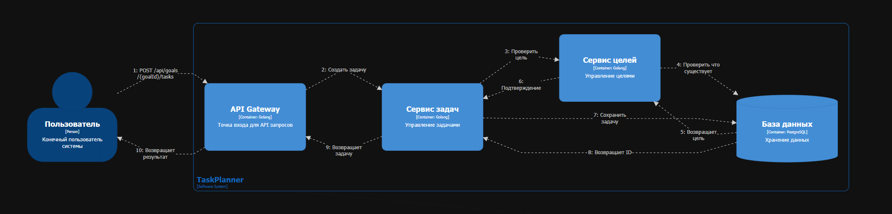

# TaskPlanner (вариант 10)

## Задание

Сервис планирования задач. Приложение должно содержать следующие данные:
- цель
- задача
- исполнитель

## Диаграммы

### System Context View

### Container View

### Пример Use Case: создание новой задачи на пути к цели

